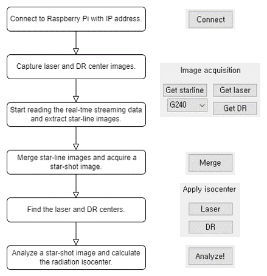

# StarshotAnalyzer

> The schematic diagram of star-shot image analysis is as follows:

## Features
* Obtaining a star-shot image through a series of proton irradiations at various gantry angles
* Finding image isocenter
* Finding laser isocenter
* Star-shot analysis using Pylinac to compute the minimum circle radius and the position of the radiation isocenter

## Installation
* The Starshot analyzer requires Pylinac which can be installed using the following instructions:
https://pylinac.readthedocs.io/en/latest/installation.html

